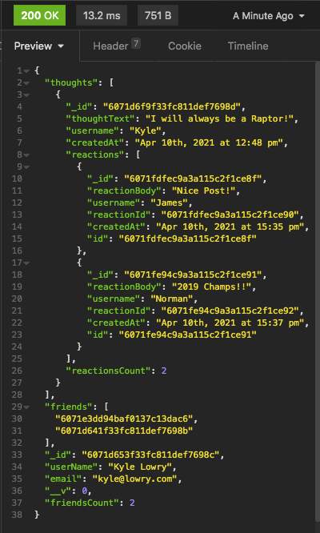
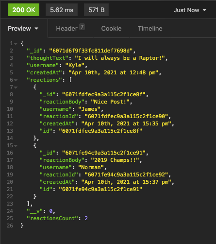
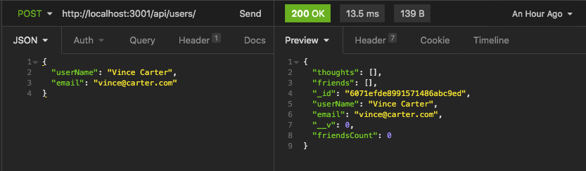
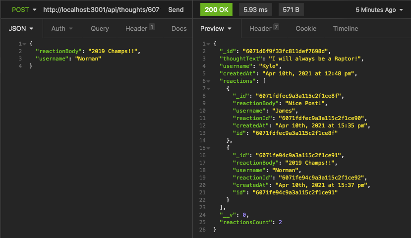
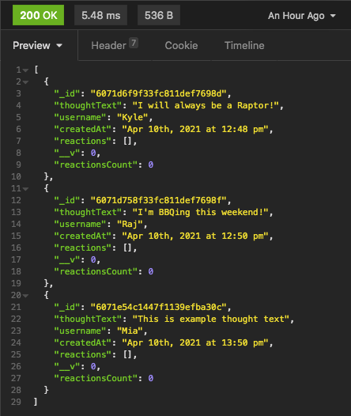

# Social-Network-API

## Table of Contents

1. [Description](#description)
2. [License](#license)
3. [Dependencies](#dependencies)
4. [Screenshots](#screenshots)
5. [Demonstration](#demonstration)
6. [Questions](#questions)

### Description

AS A social media startup
I WANT an API for my social network that uses a NoSQL database
SO THAT my website can handle large amounts of unstructured data

### License

This application is covered under the [MIT](https://opensource.org/licenses/MIT) license.

### Dependencies

* `"express": "^4.17.1"`
* `"mongoose": "^5.12.3"`

### Screenshots

GET request on a single user:

GET request on a single thought :

POST requiest to create a user:

POST request to add a reaction:

GET request on all thoughts:

### Demonstration

[Click to view part 1 of the demo](https://drive.google.com/file/d/1VfjQ_7quZpirDYgEnUZ_I4zsGXKpAuWB/view)

[Click to view part 2 of the demo](https://drive.google.com/file/d/1oZpijdelDu0jZ8i8SbquxNZ7c2lPAwpt/view)

### Questions

Github Username: **Rajendra-Dhanraj**

[Click to follow and view my Github profile!](https://github.com/Rajendra-Dhanraj)

Alternatively, I can be contacted via email: **Rajendra.Dhanraj@gmail.com**
